# Architecture Documentation

## Overview

The Real-time Messaging App follows a modern full-stack architecture designed for scalability, maintainability, and real-time performance. The system is built using a client-server model with clear separation of concerns and well-defined interfaces.

## System Architecture

### High-Level Architecture Diagram

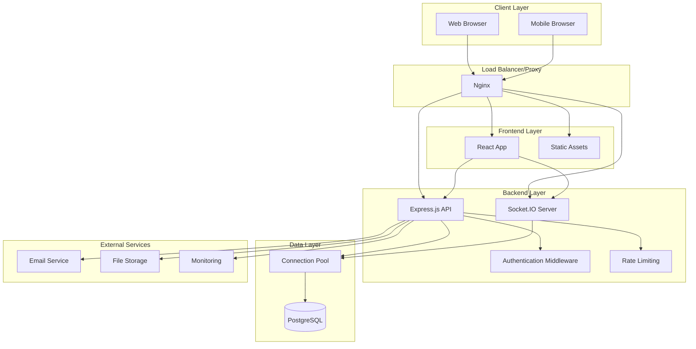

## Component Architecture

### Frontend Architecture

The frontend follows a component-based architecture using React with the following patterns:

#### Component Hierarchy
```
App
├── AuthProvider
├── SocketProvider
├── ToastProvider
├── Router
    ├── LoginPage
    ├── RegisterPage
    └── MainLayout
        ├── Sidebar
        │   ├── ChatTab
        │   └── ContactsTab
        ├── TopBar
        └── MainContent
            ├── ChatInterface
            │   ├── MessageList
            │   ├── MessageInput
            │   └── TypingIndicator
            └── ContactsPage
                ├── ContactsList
                ├── ContactsSearch
                └── AddContactModal
```

#### State Management
- **React Context**: Global state management for authentication, socket connection, and UI state
- **Local State**: Component-specific state using useState and useReducer hooks
- **Custom Hooks**: Reusable logic for common operations (useSocket, useAuth, useMessages)

#### Data Flow
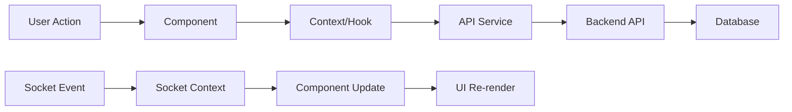

### Backend Architecture

The backend follows a layered architecture with clear separation of concerns:

#### Layer Structure
```
Presentation Layer (Routes)
├── Authentication Routes
├── User Routes
├── Contact Routes
├── Message Routes
└── Socket.IO Handlers

Business Logic Layer (Services)
├── Authentication Service
├── User Service
├── Contact Service
├── Message Service
└── Socket Service

Data Access Layer (Repositories)
├── User Repository
├── Contact Repository
├── Message Repository
└── Database Connection Pool

Infrastructure Layer
├── Database Configuration
├── JWT Utilities
├── Password Hashing
├── Error Handling
└── Logging
```

#### Request Flow
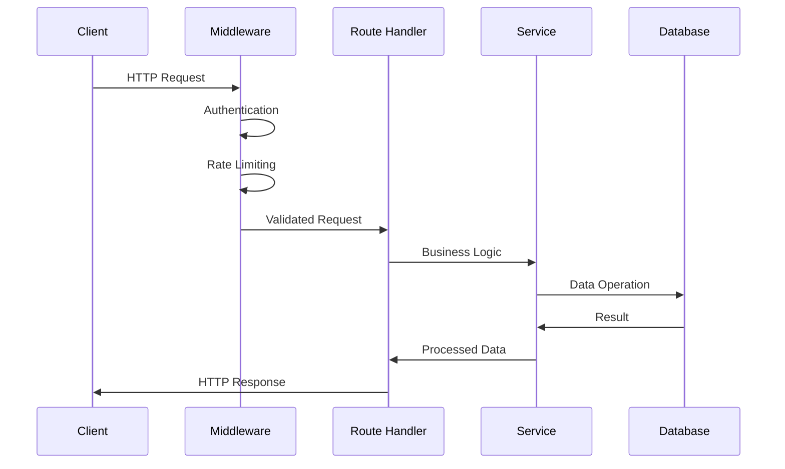

## Database Architecture

### Schema Design

The database follows a normalized relational design optimized for messaging applications:

```sql
-- Users table
CREATE TABLE users (
    id SERIAL PRIMARY KEY,
    name VARCHAR(100) NOT NULL,
    email VARCHAR(255) UNIQUE NOT NULL,
    password_hash VARCHAR(255) NOT NULL,
    created_at TIMESTAMP DEFAULT CURRENT_TIMESTAMP,
    updated_at TIMESTAMP DEFAULT CURRENT_TIMESTAMP,
    last_seen TIMESTAMP DEFAULT CURRENT_TIMESTAMP
);

-- Contacts relationship table
CREATE TABLE contacts (
    id SERIAL PRIMARY KEY,
    user_id INTEGER REFERENCES users(id) ON DELETE CASCADE,
    contact_user_id INTEGER REFERENCES users(id) ON DELETE CASCADE,
    created_at TIMESTAMP DEFAULT CURRENT_TIMESTAMP,
    UNIQUE(user_id, contact_user_id)
);

-- Messages table
CREATE TABLE messages (
    id SERIAL PRIMARY KEY,
    sender_id INTEGER REFERENCES users(id) ON DELETE CASCADE,
    recipient_id INTEGER REFERENCES users(id) ON DELETE CASCADE,
    content TEXT NOT NULL,
    created_at TIMESTAMP DEFAULT CURRENT_TIMESTAMP,
    read_at TIMESTAMP NULL,
    message_type VARCHAR(20) DEFAULT 'text'
);

-- Indexes for performance
CREATE INDEX idx_messages_conversation ON messages(sender_id, recipient_id, created_at);
CREATE INDEX idx_messages_recipient ON messages(recipient_id, created_at);
CREATE INDEX idx_users_email ON users(email);
CREATE INDEX idx_contacts_user ON contacts(user_id);
```

### Database Relationships

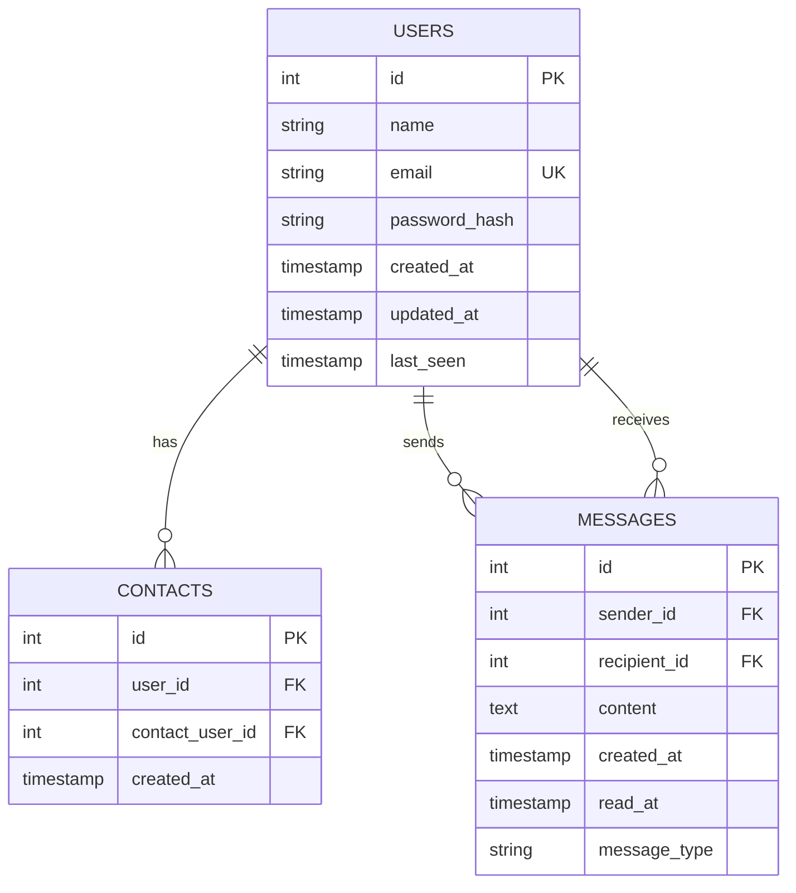

## Real-time Communication Architecture

### Socket.IO Implementation

The real-time communication is built using Socket.IO with the following architecture:

#### Connection Management
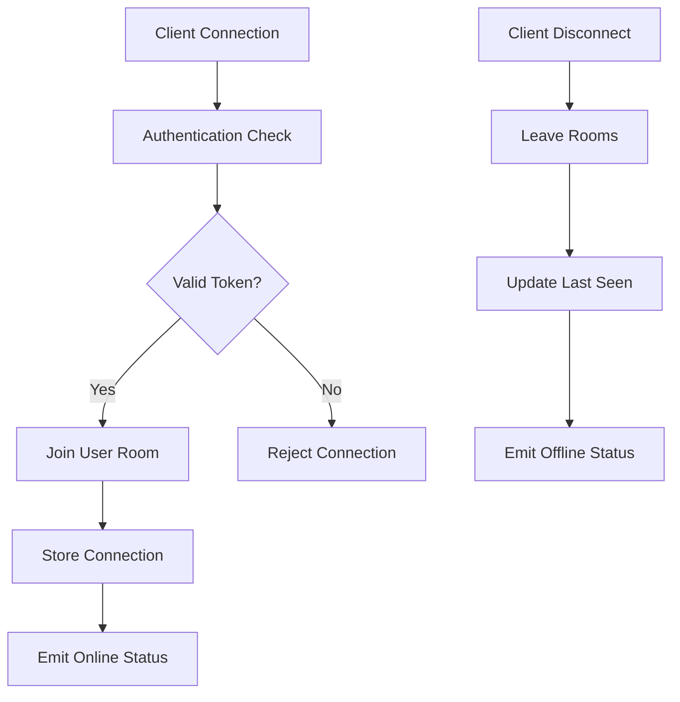

#### Message Flow
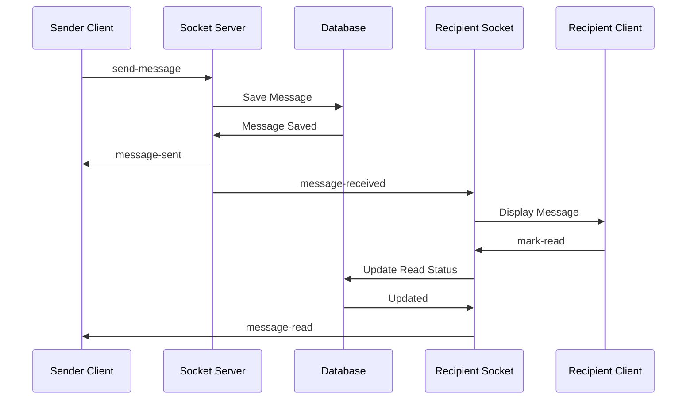

#### Room Management
- **User Rooms**: Each user joins a room named `user_${userId}` for receiving messages
- **Typing Rooms**: Temporary rooms for typing indicators between specific users
- **Presence Tracking**: Global tracking of online/offline status

## Security Architecture

### Authentication & Authorization

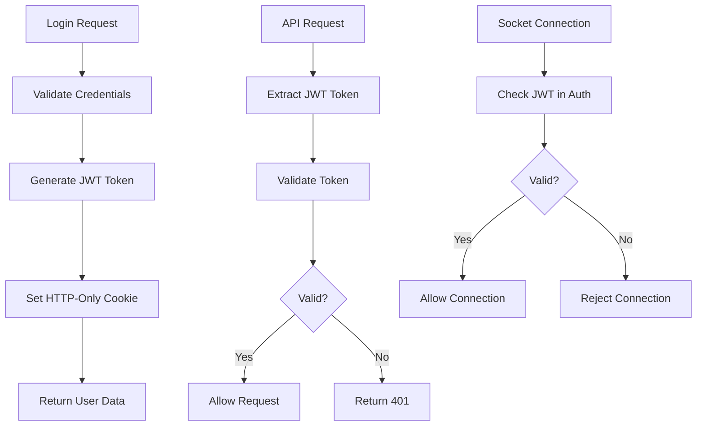

### Security Layers

1. **Transport Security**: HTTPS/WSS encryption
2. **Authentication**: JWT tokens with secure generation
3. **Authorization**: Role-based access control
4. **Input Validation**: Comprehensive input sanitization
5. **Rate Limiting**: Request throttling and abuse prevention
6. **CORS Protection**: Strict origin validation
7. **SQL Injection Prevention**: Parameterized queries
8. **XSS Protection**: Content Security Policy headers

## Performance Architecture

### Optimization Strategies

#### Frontend Performance
- **Code Splitting**: Dynamic imports for route-based splitting
- **Virtual Scrolling**: Efficient rendering of large message lists
- **Memoization**: React.memo and useMemo for expensive operations
- **Lazy Loading**: Progressive loading of message history
- **Caching**: Browser caching for static assets

#### Backend Performance
- **Connection Pooling**: Efficient database connection management
- **Query Optimization**: Indexed queries and pagination
- **Caching**: In-memory caching for frequently accessed data
- **Compression**: Gzip compression for API responses
- **Rate Limiting**: Prevent resource exhaustion

#### Database Performance
- **Indexing Strategy**: Optimized indexes for query patterns
- **Pagination**: Limit result sets for large datasets
- **Connection Pooling**: Manage database connections efficiently
- **Query Optimization**: Efficient SQL queries with proper joins

### Scalability Considerations

#### Horizontal Scaling
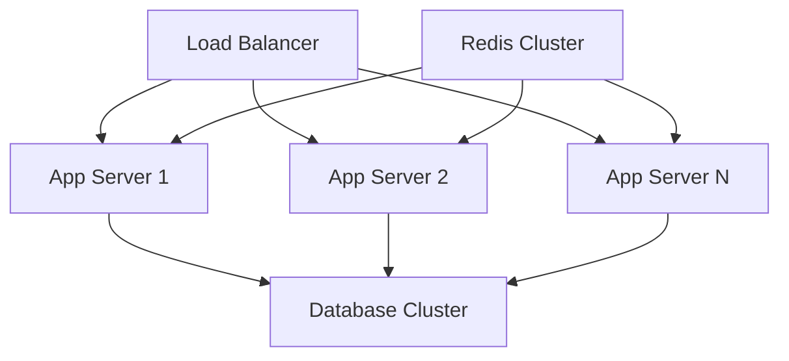

#### Vertical Scaling
- **Resource Optimization**: CPU and memory usage optimization
- **Database Tuning**: PostgreSQL configuration optimization
- **Caching Layers**: Multiple levels of caching

## Deployment Architecture

### Production Environment

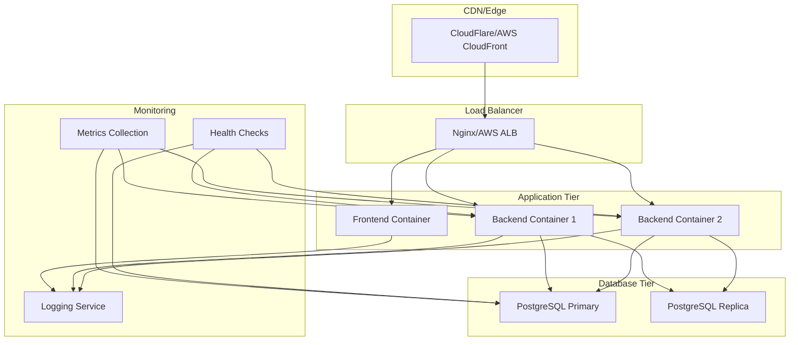

### Container Architecture

#### Docker Containers
- **Frontend Container**: Nginx serving React build
- **Backend Container**: Node.js application
- **Database Container**: PostgreSQL with persistent volumes
- **Reverse Proxy**: Nginx for routing and SSL termination

#### Container Orchestration
- **Docker Compose**: Development and simple production deployments
- **Kubernetes**: Advanced production deployments with auto-scaling
- **Health Checks**: Container health monitoring and restart policies

## Monitoring and Observability

### Logging Architecture
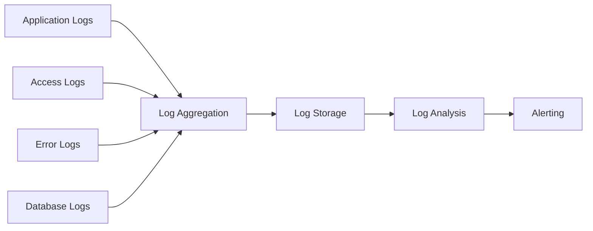

### Metrics Collection
- **Application Metrics**: Response times, error rates, throughput
- **System Metrics**: CPU, memory, disk usage
- **Database Metrics**: Query performance, connection counts
- **Business Metrics**: User activity, message volume

### Health Checks
- **Application Health**: API endpoint health checks
- **Database Health**: Connection and query health
- **Socket Health**: WebSocket connection monitoring
- **External Dependencies**: Third-party service health

## Development Architecture

### Development Workflow
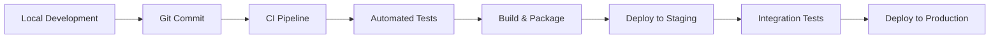

### Environment Strategy
- **Development**: Local development with hot reloading
- **Staging**: Production-like environment for testing
- **Production**: Live environment with monitoring and backups

### Code Organization
```
src/
├── components/          # React components
│   ├── common/         # Shared components
│   ├── pages/          # Page components
│   └── layout/         # Layout components
├── contexts/           # React contexts
├── hooks/              # Custom hooks
├── services/           # API and external services
├── utils/              # Utility functions
├── types/              # TypeScript type definitions
└── __tests__/          # Test files
```

## Future Architecture Considerations

### Microservices Migration
- **Service Decomposition**: Split monolith into focused services
- **API Gateway**: Centralized API management
- **Service Discovery**: Dynamic service location
- **Inter-service Communication**: Message queues and event streaming

### Advanced Features
- **File Sharing**: Media upload and sharing capabilities
- **Push Notifications**: Mobile and web push notifications
- **Video/Voice Calls**: WebRTC integration
- **Message Encryption**: End-to-end encryption
- **Multi-tenancy**: Support for multiple organizations

### Performance Enhancements
- **Caching Layer**: Redis for session and data caching
- **Message Queues**: Asynchronous processing with RabbitMQ/Kafka
- **CDN Integration**: Global content delivery
- **Database Sharding**: Horizontal database partitioning